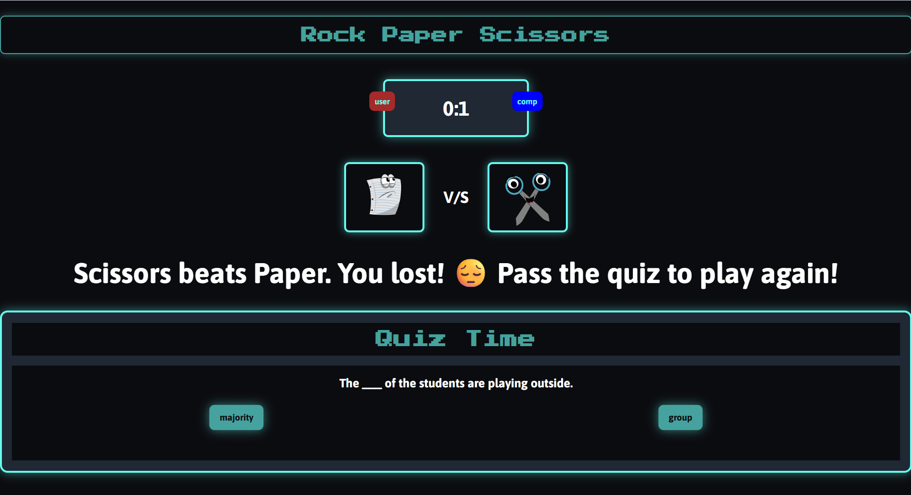

# 🎮 Rock Paper Scissors + Quiz Game (Flask + Python)

This is a web-based game built with Flask that combines two classic mini-games:  
1. **Rock Paper Scissors**  
2. **Multiple-Choice Quiz Game**

## 🚀 Features

- Simple web interface built with Flask and HTML/CSS
- Rock Paper Scissors game with basic logic vs computer
- Quiz game with multiple-choice questions
- Score tracking and game feedback
- Lightweight and easy to run locally

---

## 🧰 Tech Stack

- **Backend:** Python, Flask
- **Frontend:** HTML, CSS, Bootstrap

---

## 📦 Project Structure
rock-quiz-game/
├── app.py
├── static/
  └── app.js
  ├── style.css
    ├── data/
       └── quizQuestions.json
├── templates/
 └── index.html
├── requirements.txt
└── README.md

## 🛠️ Installation & Setup

### 1. Clone the repository

- git clone https://github.com/wafafatima66/rock-paper-scissor-quiz-app-python
- cd rock-quiz-game

### 2. Create a virtual environment

- python -m venv venv
- source venv/bin/activate  # On Windows: venv\Scripts\activate

### 3. Install dependencies

- pip install -r requirements.txt

### 4. Run the application

- python app.py

## 🎮 How to Play
### 🪨 Rock Paper Scissors
- Choose Rock, Paper, or Scissors

- The computer will randomly choose one too

- Result is shown with score tracking

### 📚 Quiz Game
- Answer multiple-choice questions

- Each correct answer increases your score

- Final result shown at the end

## Screenshots

